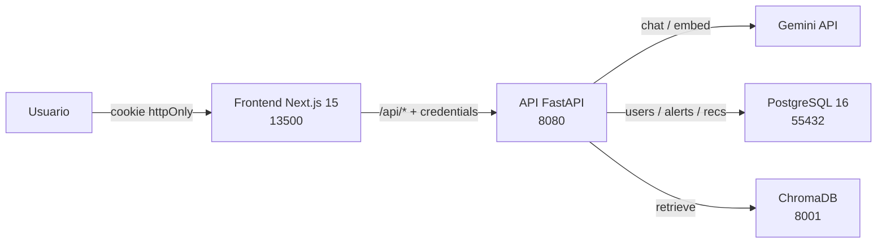
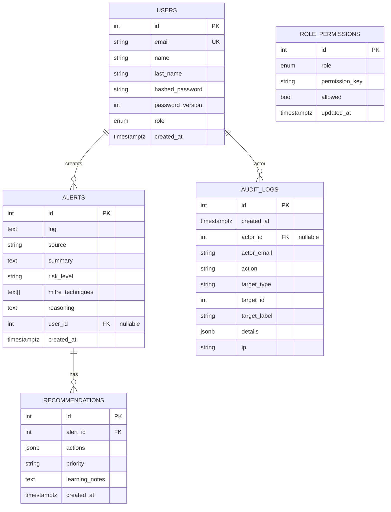

# Arquitectura tecnica

## Vista general



## Estructura del repositorio

```text
soc-copilot/
├── apps/
│   ├── api/                Backend FastAPI
│   │   ├── app/
│   │   │   ├── main.py
│   │   │   ├── config.py      env-driven Settings
│   │   │   ├── db.py          SQLAlchemy engine + init_db (idempotente)
│   │   │   ├── models.py      User, Alert, Recommendation
│   │   │   ├── routers/       auth, alerts, explain, recommend, chat, kb, llm, health
│   │   │   ├── schemas/       Pydantic
│   │   │   ├── services/      llm, explainer, recommender, chat, rag, auth
│   │   │   └── middleware/    ratelimit, auth (Depends)
│   │   ├── scripts/           ingest_kb (MITRE+OWASP) + owasp_top10 dataset
│   │   ├── tests/             test_smoke (unit) + test_auth (unit) + test_e2e
│   │   ├── ruff.toml
│   │   └── Dockerfile
│   └── web/                Frontend Next.js
│       ├── src/
│       │   ├── app/           login, alerts, respond, history, chat, page (home)
│       │   ├── components/    AuthGate, ModelSelector, RiskBadge
│       │   └── lib/           api, auth, useModel
│       ├── eslint.config.mjs  flat config (next/core-web-vitals)
│       └── Dockerfile         multi-stage: deps → dev / builder → runner
├── infra/
│   ├── docker-compose.yml             dev/local
│   ├── docker-compose.prod.example.yml plantilla Hetzner
│   ├── caddy/Caddyfile
│   └── postgres/init.sql
├── docs/
└── .github/workflows/ci.yml   jobs: api, e2e (con Postgres service), web
```

## Backend (FastAPI)

Tecnologías:

- Python 3.12, FastAPI, Pydantic v2, SQLAlchemy 2.
- `psycopg[binary]` para PostgreSQL.
- `google-genai` para Gemini (chat + embeddings).
- `chromadb` HttpClient para retrieval.
- `passlib[bcrypt]` + `PyJWT` para auth.

### Componentes clave

| Archivo | Rol |
|---------|-----|
| `app/main.py` | Construye la app FastAPI, registra routers, ejecuta `init_db()` en lifespan startup |
| `app/config.py` | Settings tipadas (env). Define defaults seguros para dev y allowlist de modelos LLM |
| `app/db.py` | Engine + sessionmaker + `init_db()` que ejecuta `alembic upgrade head` en Postgres (con bridge `alembic stamp head` para DBs legacy creadas vía `create_all`); SQLite cae a `create_all` para tests |
| `app/models.py` | `User` (incluye `name`, `last_name`, `password_version`), `Alert`, `Recommendation`, `AuditLog`, `RolePermission` |
| `app/services/llm.py` | `LLMAdapter` abstracto + `GeminiAdapter`. Errores se separan en `LLMProviderError` y `LLMResponseError`; routers los mapean a 502 genéricos |
| `app/services/explainer.py` | Construye prompt con `BEGIN/END_UNTRUSTED_LOG` y schema JSON estricto |
| `app/services/recommender.py` | Igual que explainer + reglas para evitar acciones destructivas sin aprobación humana |
| `app/services/chat.py` | Orquesta retrieval (Chroma) + chat (Gemini) con doble delimitador (KB + log) |
| `app/services/rag.py` | `Retriever.retrieve(query, k)` + `kb_status()` |
| `app/services/auth.py` | bcrypt hash/verify + JWT HS256 issue/decode (incluye claim `pv`) |
| `app/services/audit.py` | Helper `log_audit()` que añade filas a `audit_logs`; flush sin commit para que la auditoría caiga junto con la transacción del caller |
| `app/services/permissions.py` | Registry estática de permisos + tabla `role_permissions` para overrides + dependency `require_perm("clave")` con permission `permissions.manage` lockeada anti-lockout |
| `app/middleware/auth.py` | `get_current_user` (cookie o Bearer) que valida `payload["pv"] == user.password_version` para invalidar sesiones tras reset; `CurrentUser` alias |
| `app/middleware/ratelimit.py` | Sliding window in-memory por IP, threading lock, configurable por env |

### Endpoints

Detalle completo en [docs/06-api-reference.md](06-api-reference.md). Resumen:

| Método | Path | Auth | Rate-limit | Notas |
|--------|------|------|------------|-------|
| GET    | `/api/health` | público | no | smoke |
| GET    | `/api/llm/models` | público | no | allowlist + default |
| GET    | `/api/kb/status` | público | no | conteo MITRE/OWASP |
| POST   | `/api/auth/register` | público | no | primer usuario = admin |
| POST   | `/api/auth/login` | público | no | set-cookie httpOnly |
| POST   | `/api/auth/logout` | público | no | clear-cookie |
| GET    | `/api/auth/me` | sesión | no | |
| PUT    | `/api/auth/me` | sesión | no | edita `name`, `last_name`, `email` |
| POST   | `/api/explain` | sesión | sí | persiste con user_id |
| POST   | `/api/recommend` | sesión | sí | acepta `alert_id` o `log` |
| POST   | `/api/chat` | sesión | sí | RAG sobre `soc_kb` |
| GET    | `/api/alerts` | sesión | no | analyst ve los suyos, admin ve todo |
| GET    | `/api/alerts/{id}` | sesión | no | con recommendations anidadas |
| GET    | `/api/admin/users` | `users.list` | no | listado completo |
| POST   | `/api/admin/users` | `users.create` | no | crear con rol explícito |
| PUT    | `/api/admin/users/{id}/password` | `users.update_password` | no | bumpea `password_version` |
| PUT    | `/api/admin/users/{id}/role` | `users.update_role` | no | bumpea `password_version` |
| DELETE | `/api/admin/users/{id}` | `users.delete` | no | bloquea último admin / self |
| GET    | `/api/admin/audit` | `audit.view` | no | append-only, filtros action/actor |
| GET    | `/api/admin/permissions` | `permissions.manage` | no | matriz role × key efectiva |
| PUT    | `/api/admin/permissions` | `permissions.manage` | no | bulk update con audit diff |

## Frontend (Next.js)

Tecnologías: Next.js 15.5, React 19, TypeScript 5.9, Tailwind 3.4, ESLint 9 flat config.

### Pantallas

| Ruta | Función | Auth |
|------|---------|------|
| `/` | Home con enlaces (admin ve `/admin`) | requerida |
| `/login` | Login + register en una pantalla | pública |
| `/alerts` | Alert Explainer (acepta `?import=true` desde `/logs`) | requerida |
| `/logs` | Analizador local con filtros de red, paginación y selección | requerida |
| `/respond?alert_id=N` | Next Step Recommender | requerida |
| `/history` | Histórico filtrado por ownership | requerida |
| `/chat` | Conversación con RAG + citas | requerida |
| `/profile` | Edición de nombre, apellidos y email | requerida |
| `/admin` | Tabs Usuarios / Roles / Permisos / Auditoría | rol admin |

### Header global

`<GlobalHeader>` (en `components/AuthGate.tsx`) está montado en
`app/layout.tsx`, así que aparece en todas las páginas autenticadas:
brand a `/`, botón **← Inicio** (oculto en `/`), badge clicable que va a
`/profile`, botón Salir.

### Cliente API

`src/lib/api.ts` centraliza fetch con:

- `credentials: "include"` para enviar la cookie de sesión.
- Timeout de 60s con `AbortController`.
- `ApiError` tipada con `status` + `detail` para diferenciar 401 / 422 / 502.

### Hooks compartidos

| Hook | Para qué |
|------|----------|
| `useAuth()` (`src/lib/auth.tsx`) | Estado de usuario actual + signIn/signOut + sync cross-tab por `storage` y `focus` |
| `useRequireAuth()` | Redirige a `/login?next=...` si no hay sesión; expone `ready` para gateo de render |
| `useModel()` (`src/lib/useModel.ts`) | Trae allowlist + persiste selección en localStorage |

## Infraestructura local

Servicios de `infra/docker-compose.yml`:

| Servicio | Imagen | Puerto host | Healthcheck |
|----------|--------|-------------|-------------|
| `postgres` | `postgres:16-alpine` | 55432 → 5432 | `pg_isready` |
| `chroma` | `chromadb/chroma:0.5.23` | 8001 → 8000 | (sin) |
| `api` | build local Python 3.12 | 8080 → 8080 | curl `/api/health` |
| `web` | build local Node 22 (target dev) | 13500 → 3000 | wget `/` |

Volúmenes persistentes: `postgres-data`, `chroma-data`.

Bind-mounts dev (live-reload): `apps/api/app`, `apps/api/tests` (ro),
`apps/api/scripts` (ro), `apps/web/src`, `apps/web/public`.

Para producción: ver `infra/docker-compose.prod.example.yml`. Diferencias
documentadas en cabecera del archivo y en [security.md](security.md).

## Persistencia (PostgreSQL)



Notas:

- `user_id` es nullable: alertas pre-fase-4 quedan sin propietario y solo
  son visibles para `admin`.
- `recommendations.alert_id` cascade-deletes con la alerta padre.
- `users.email` único, indexado.
- `users.password_version` arranca a 0 y se incrementa en cada reset o
  cambio de rol; el JWT lleva el valor en el claim `pv` y el middleware
  rechaza tokens cuyo `pv` no coincide con el actual.
- `audit_logs` es append-only: los endpoints admin nunca borran ni
  actualizan filas. `actor_id` con `ON DELETE SET NULL` para preservar
  el rastro tras borrar al actor.
- `role_permissions` solo guarda **deviaciones** sobre los defaults de
  la registry (`services/permissions.py`); si la tabla está vacía, el
  sistema cae a la política original.

## Knowledge base (ChromaDB)

Colección única `soc_kb` con ~700 documentos:

- `mitre:T####` — todas las técnicas vigentes de MITRE ATT&CK Enterprise
  (~691). Texto = `id — name\nTactics: ...\ndescription`.
- `owasp:A##:2025` — 10 categorías OWASP Top 10 2025 (descripciones
  curadas).

Embeddings generados con `gemini-embedding-001` (3072 dim).

Detalle operativo en [08-rag-ingestion.md](08-rag-ingestion.md).

## Integración LLM

`LLMAdapter` mantiene las llamadas al proveedor aisladas. Hoy solo
`GeminiAdapter`; añadir Claude/OpenAI/Ollama es escribir un sibling.

### Modelo configurable

- `GEMINI_CHAT_MODEL` define el default.
- `GEMINI_CHAT_MODELS_ALLOWLIST` define qué puede pedir el cliente.
- Cada request acepta opcionalmente `"model"`. Validado en pydantic
  (allowlist) + adapter (defense in depth).

### Mitigaciones de prompt injection

- Logs envueltos en `BEGIN_UNTRUSTED_LOG` / `END_UNTRUSTED_LOG`.
- KB envuelta en `BEGIN_UNTRUSTED_KB` / `END_UNTRUSTED_KB`.
- System prompt instruye al modelo a tratar ambos como dato y no obedecer
  instrucciones internas.
- Recommender añade reglas anti-acciones-destructivas + obligación de
  prefijo `[REQUIERE APROBACIÓN HUMANA]`.

## Seguridad operacional

- Cookie `soc_session` httpOnly + SameSite=Lax + (Secure si `COOKIE_SECURE=true`).
- Rate limit por IP configurable (`RATE_LIMIT_*`).
- `LLMProviderError` y `LLMResponseError` mapean a `502 AI provider error`
  / `502 AI response could not be processed` sin filtrar quota, modelo
  ni stack al cliente.

Detalle en [security.md](security.md).

## Despliegue futuro

Plan documentado en [roadmap.md](roadmap.md). El esqueleto prod ya está en
`infra/docker-compose.prod.example.yml` con Caddy 2 fronting (TLS automático).
