# Diagramas del sistema

Todos los diagramas usan **Mermaid**. GitHub, VS Code (con la extensión
"Markdown Preview Mermaid Support") y la mayoría de viewers Markdown
modernos los renderizan en línea. Si tu visor no, copia el bloque a
<https://mermaid.live>.

Índice:

1. [Contexto](#1-contexto-del-sistema)
2. [Arquitectura de despliegue (Docker Compose)](#2-arquitectura-de-despliegue-docker-compose)
3. [Componentes internos del backend](#3-componentes-internos-del-backend)
4. [Esquema de base de datos](#4-esquema-de-base-de-datos)
5. [Casos de uso por rol](#5-casos-de-uso-por-rol)
6. [Flujo de login y emisión del JWT](#6-flujo-de-login-y-emisión-del-jwt)
7. [Flujo de Alert Explainer](#7-flujo-de-alert-explainer)
8. [Flujo de Chat con RAG](#8-flujo-de-chat-con-rag)
9. [Flujo de reset de contraseña + invalidación de sesiones](#9-flujo-de-reset-de-contraseña--invalidación-de-sesiones)
10. [Flujo del analizador de logs](#10-flujo-del-analizador-de-logs-logs)
11. [Ciclo de vida de una alerta](#11-ciclo-de-vida-de-una-alerta)
12. [Pipeline de ingesta de la KB (Chroma)](#12-pipeline-de-ingesta-de-la-kb-chroma)
13. [Resolución de permisos (RBAC dinámico)](#13-resolución-de-permisos-rbac-dinámico)

---

## 1. Contexto del sistema

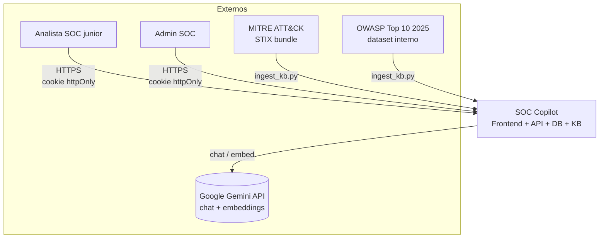

**Lectura rápida**: SOC Copilot es un sistema cerrado al que dos perfiles
acceden por web; el sistema delega la inferencia a Gemini y se nutre de
dos fuentes externas para su KB (que se ingesta una sola vez por
deploy).

---

## 2. Arquitectura de despliegue (Docker Compose)

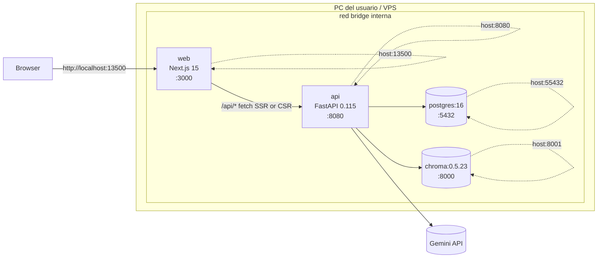

Volúmenes persistentes: `postgres-data`, `chroma-data`. Bind-mounts
read-write para hot-reload de `apps/api/app` y `apps/web/src`. En
producción se sustituye `web` y `api` por imágenes inmutables y se
añade Caddy delante para TLS automático.

---

## 3. Componentes internos del backend

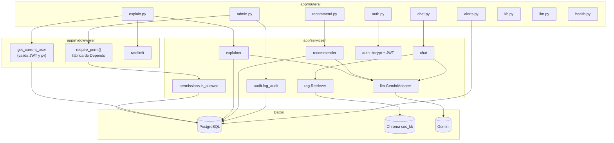

`require_perm("clave")` y `get_current_user` son las dos puertas que
todo router de negocio cruza. `services/llm` aísla al proveedor: añadir
otro LLM es escribir un sibling de `GeminiAdapter`.

---

## 4. Esquema de base de datos

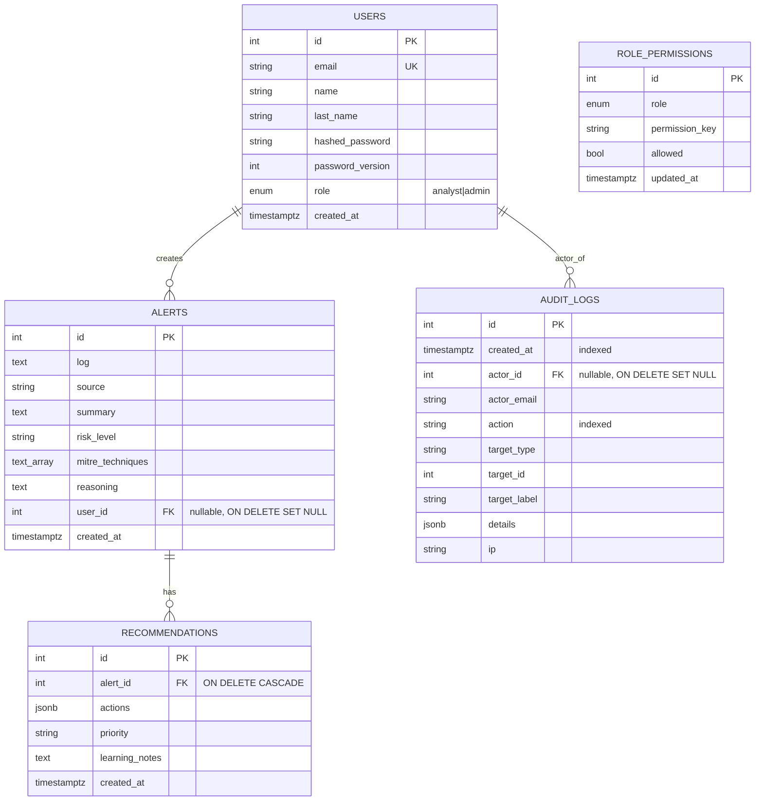

Reglas:

- `users.email` único e indexado.
- `alerts.user_id` nullable: alertas pre-fase-4 quedan ownerless y solo
  son visibles para `admin`.
- `recommendations.alert_id` cascade-deletes al borrar la alerta padre.
- `audit_logs` y `role_permissions` no tienen FKs a recursos arbitrarios
  para preservar el rastro tras eliminaciones.
- `role_permissions` solo guarda **deviaciones** del default; tabla
  vacía = política original de la registry.

---

## 5. Casos de uso por rol

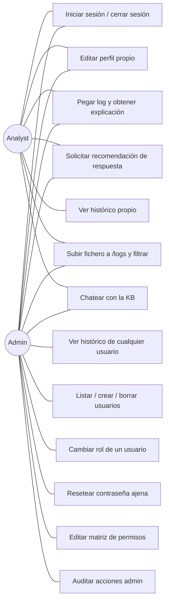

Cada caso de uso admin es un permiso individual en
`services/permissions.py` y por tanto puede delegarse al rol analyst
desde la matriz de permisos sin tocar código.

---

## 6. Flujo de login y emisión del JWT

```mermaid
sequenceDiagram
    autonumber
    actor U as Usuario
    participant W as Frontend Next.js
    participant API as FastAPI
    participant DB as PostgreSQL

    U->>W: rellena email + password<br>en /login
    W->>API: POST /api/auth/login {email, password}
    API->>DB: SELECT * FROM users WHERE email=?
    DB-->>API: row o NULL
    alt credenciales inválidas
        API-->>W: 401 invalid credentials
        W-->>U: error "credenciales inválidas"
    else credenciales válidas
        API->>API: verify_password(bcrypt)<br>issue_token(sub, role, pv)
        API-->>W: 200 + Set-Cookie soc_session<br>HttpOnly; SameSite=Lax
        W->>W: setUser(res.user)<br>localStorage broadcast
        W-->>U: redirect a /
    end
    Note over W,API: Cookie viaja en todas las requests<br>posteriores como Bearer-equivalent
```

El claim `pv` (password_version) se embebe en el JWT y se compara en
cada request protegida; si la BD lo bumpea, el token vigente queda
inválido al instante.

---

## 7. Flujo de Alert Explainer

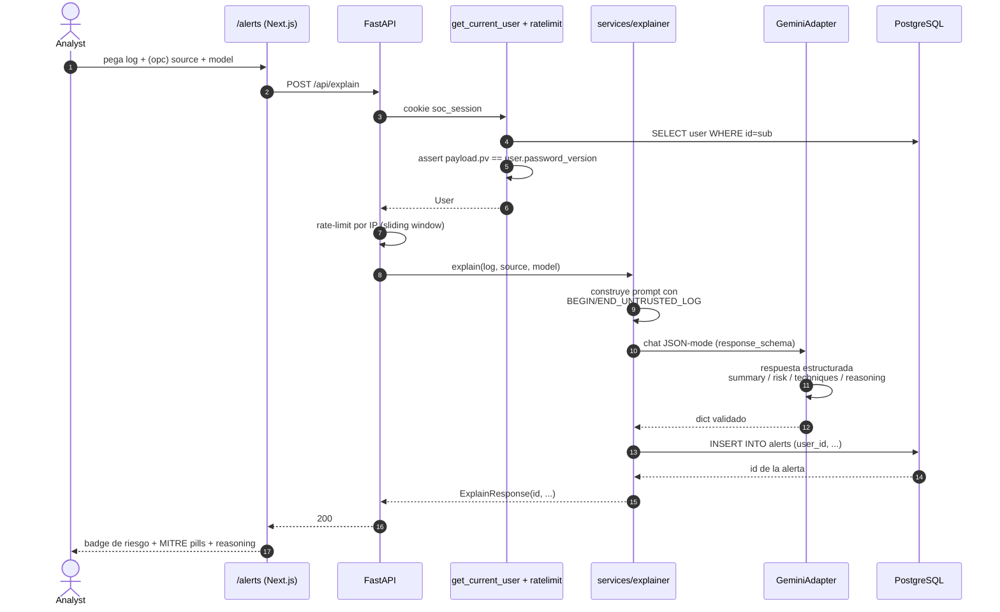

El log nunca llega al modelo como instrucción: queda envuelto entre
delimitadores `BEGIN_UNTRUSTED_LOG` / `END_UNTRUSTED_LOG`.

---

## 8. Flujo de Chat con RAG

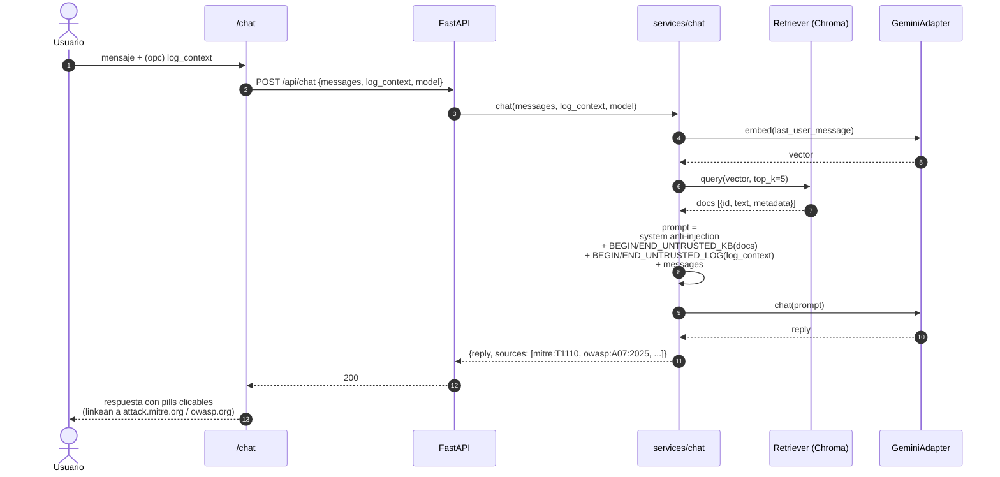

`sources` se renderiza en el front como pills y enlaza a los doc
oficiales para que el junior compruebe la cita.

---

## 9. Flujo de reset de contraseña + invalidación de sesiones

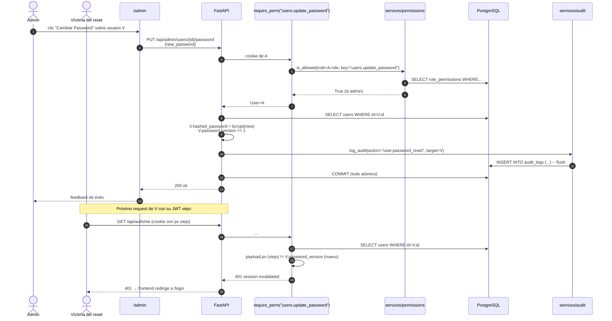

Misma mecánica para `users.update_role` (cambiar rol también bumpea
`password_version` para que el nuevo rol aplique al instante).

---

## 10. Flujo del analizador de logs (`/logs`)

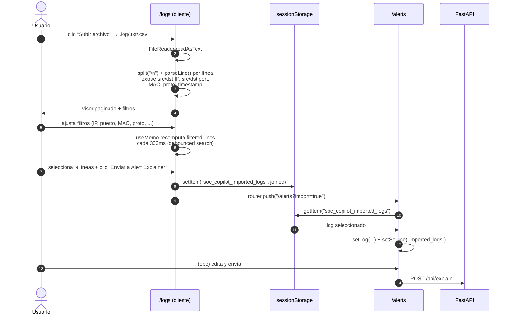

Todo el parsing y filtrado ocurre en el navegador: el log no sale del
cliente hasta que el usuario decide enviarlo al explainer.

---

## 11. Ciclo de vida de una alerta

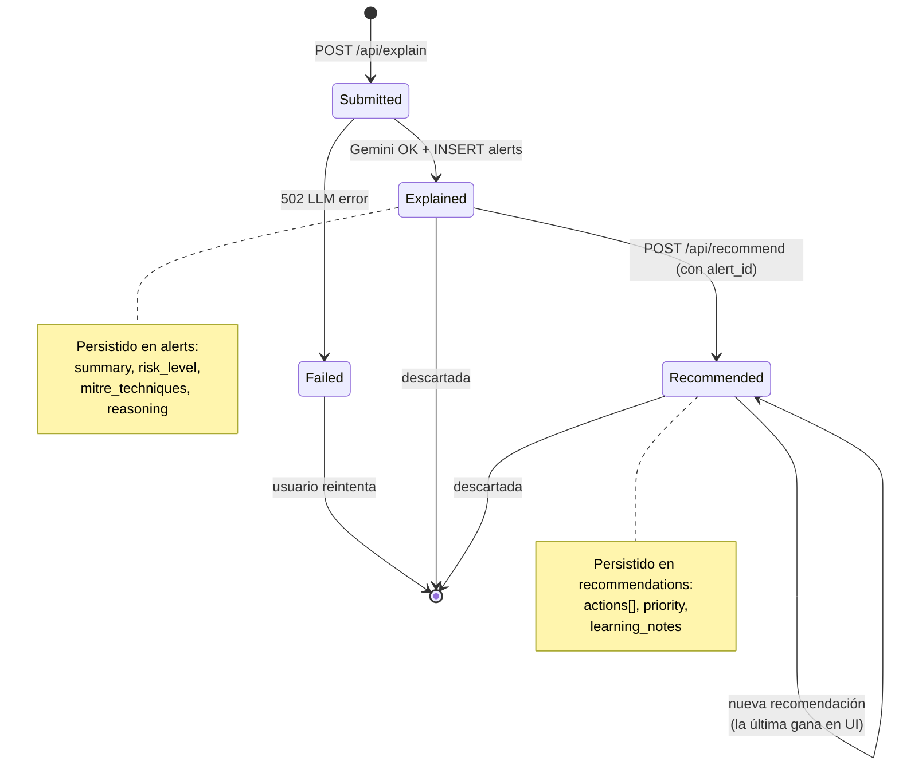

Nunca borramos alertas ni recomendaciones desde la UI. Si se borra el
usuario propietario, sus alertas pasan a `user_id NULL` (visibles solo
para admins).

---

## 12. Pipeline de ingesta de la KB (Chroma)

```mermaid
flowchart TB
    A[scripts/ingest_kb.py] --> B[Descarga STIX bundle<br>MITRE ATT&CK Enterprise]
    A --> C[Carga dataset interno<br>OWASP Top 10 2025]
    B --> D[Extrae técnicas vigentes<br>~691 entries]
    C --> E[10 entries A01..A10]
    D --> F[Normaliza a {id, text, metadata}]
    E --> F
    F --> G{Batches de 100}
    G --> H[Gemini embed-001<br>3072 dim]
    H --> I[Backoff exponencial<br>si rate-limit]
    I --> G
    G --> J[Chroma collection soc_kb<br>upsert]
    J --> K[(volumen<br>chroma-data)]

    style A fill:#1e293b,stroke:#475569,color:#e2e8f0
    style K fill:#0f172a,stroke:#475569,color:#e2e8f0
```

Idempotente: cada run puede re-ejecutarse sin duplicar (upsert por `id`).

---

## 13. Resolución de permisos (RBAC dinámico)

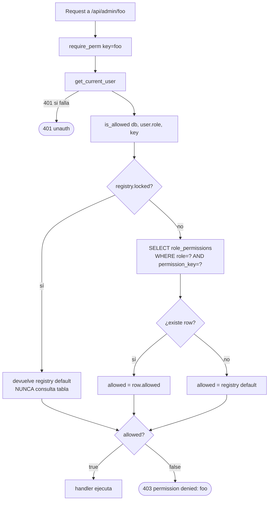

`permissions.manage` está marcada como `locked=True` en la registry: la
pestaña Permisos del UI muestra sus checkboxes en gris y el backend
rechaza cualquier intento de update sobre esa clave. Eso garantiza que
un admin nunca puede deshabilitar la gestión de permisos para todos.
