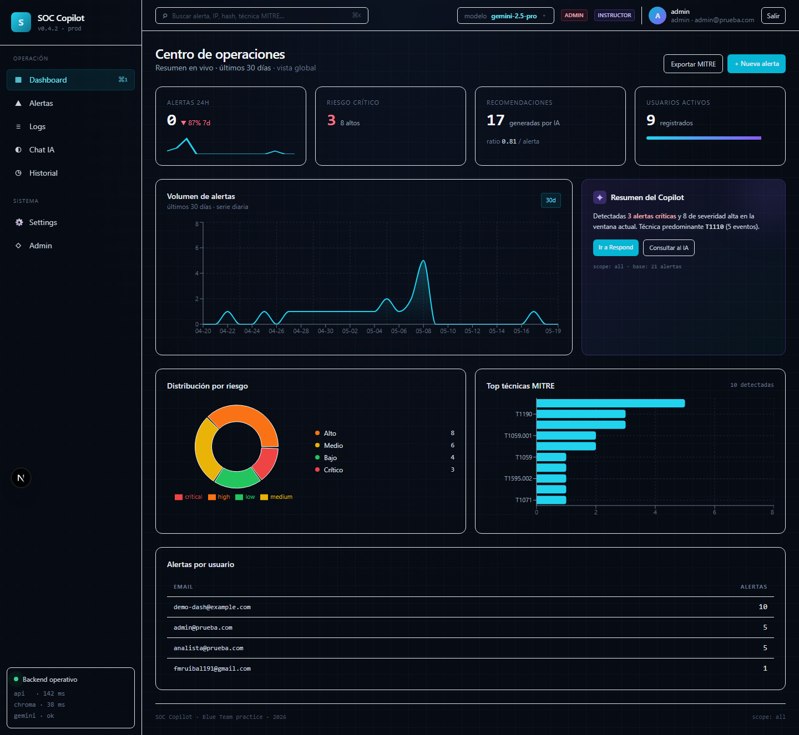
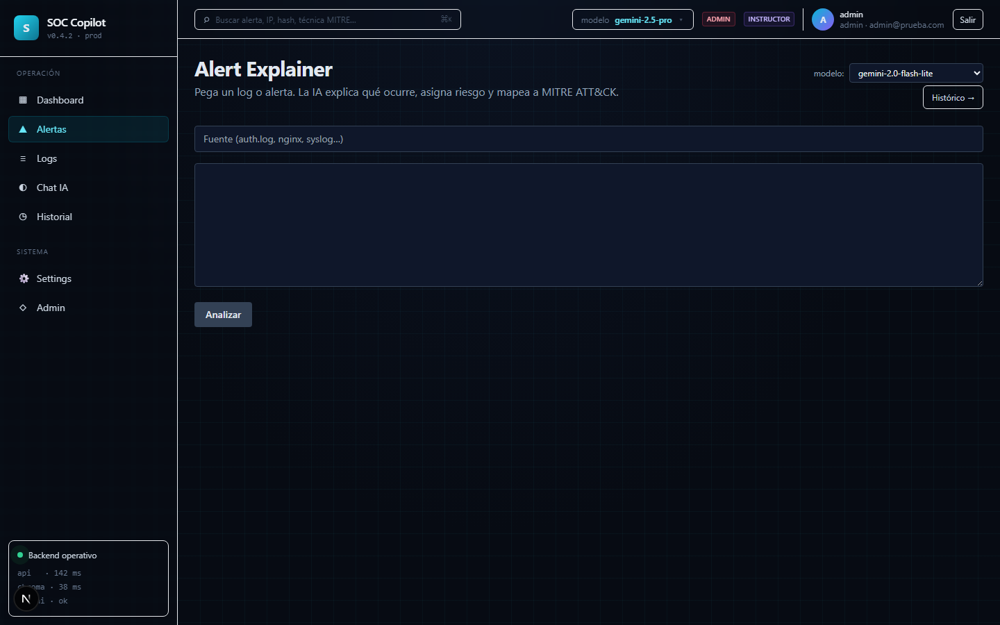
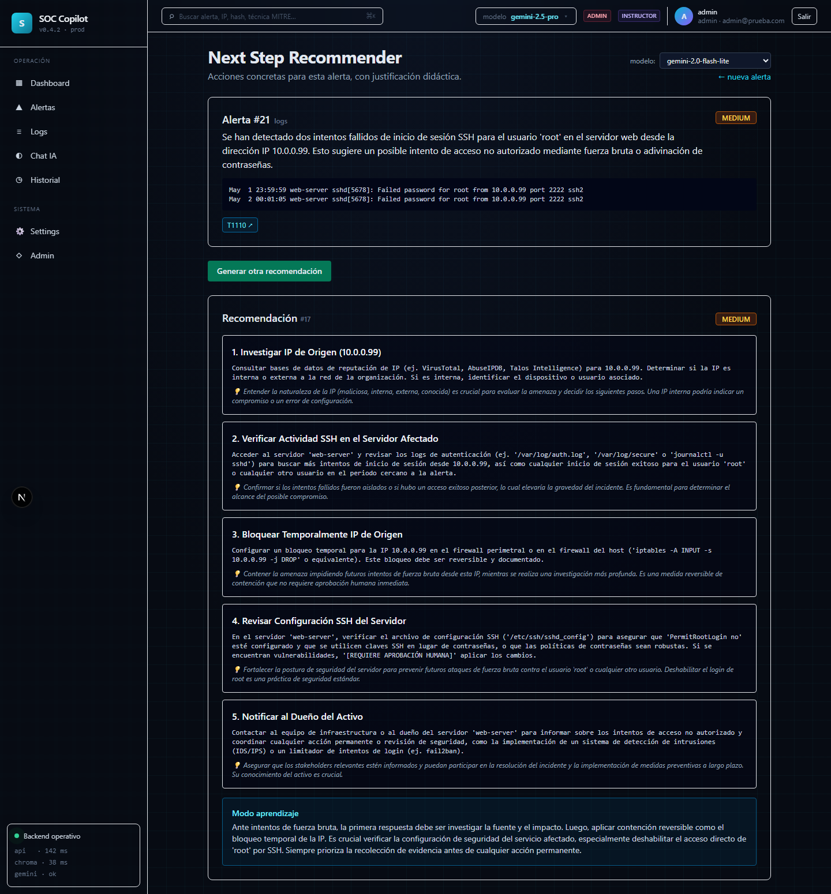
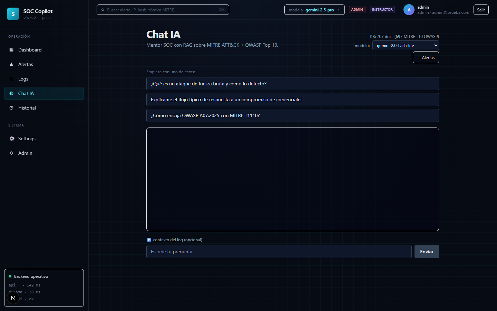

# Manual de usuario — SOC Copilot

> Guía orientada a la persona que **usa** la aplicación (analista junior o
> administrador). Para instalación, despliegue o detalles técnicos, ver
> [01-instalacion-local.md](01-instalacion-local.md), [03-arquitectura.md](03-arquitectura.md)
> y [RUNBOOK.md](RUNBOOK.md).

---

## 1. ¿Qué es SOC Copilot?

SOC Copilot es un asistente con IA pensado para apoyar a **analistas SOC
junior** durante la triage de alertas. Combina cuatro capacidades:

1. **Alert Explainer** — pega un log o alerta y obtén un análisis claro:
   resumen, severidad, técnica MITRE ATT&CK probable y siguientes pasos.
2. **Next Step Recommender** — recomendaciones accionables sobre una alerta
   ya analizada, con un *modo aprendizaje* que explica el porqué de cada paso.
3. **Chat IA con RAG** — conversación con citas verificables sobre MITRE
   ATT&CK Enterprise y OWASP Top 10 2025.
4. **Histórico y panel admin** — trazabilidad por analista, gestión de
   usuarios, roles y auditoría.

La IA **no sustituye** al analista: propone hipótesis y referencias. La
decisión final siempre es humana.

---

## 2. Acceso a la aplicación

| Entorno | URL |
|---------|-----|
| Local (desarrollo) | <http://localhost:13500> |
| **Producción (Hetzner)** | <https://soc-copilot.duckdns.org> |

### 2.1 Crear cuenta

> El registro público se puede abrir o cerrar desde el panel de
> administración. Si está cerrado verás el mensaje *"El registro está
> cerrado temporalmente. Contacta con un administrador para que cree tu
> cuenta."* — en ese caso pide al admin que te dé de alta desde
> `/admin → Usuarios`.

1. Abre `/login` y pulsa **Registrarse**.
2. Introduce nombre, email, contraseña y **nivel solicitado** (L1 / L2 /
   Instructor). La contraseña debe cumplir **todas** las reglas siguientes:
   - Al menos **10 caracteres**.
   - Incluye **mayúscula**, **minúscula**, **dígito** y **símbolo**.
   - Fortaleza zxcvbn ≥ *Aceptable* (puntuación 2/4). Se muestra una
     barra de fortaleza en tiempo real con sugerencias para mejorarla.
   - Debes confirmarla en el campo "Confirmar contraseña".
3. Al enviar el formulario recibirás un **email de verificación** en la
   dirección que indicaste. Pulsa el botón **"Verificar email"** del
   correo (válido durante 24 h). Hasta que verifiques no podrás iniciar
   sesión — el login mostrará *"Acceso denegado. ¿Tienes el email
   verificado?"*.
4. El **primer usuario** que se registra en una instalación nueva queda
   automáticamente como `admin` y con el email pre-verificado. El resto
   son `analyst` por defecto.

> La misma política de contraseñas se aplica cuando un admin resetea la
> contraseña de otro usuario desde `/admin → Usuarios`.

#### Aprobación de nivel por un admin

El nivel que solicitas (L1, L2 o Instructor) **no se aplica directamente**:
queda pendiente de aprobación por un administrador.

- Mientras no se apruebe, tu cuenta opera como **L1** independientemente
  de lo que pidieras. El nivel solicitado aparece en el panel admin con
  un badge "Pendiente".
- Cuando el admin te apruebe (o te asigne otro nivel), recibirás el nuevo
  rango la próxima vez que recargues. El nivel cambia el tono y
  profundidad de las respuestas del Copilot:
  - **L1** → más guía, paso a paso, más explicaciones didácticas.
  - **L2** → más conciso, asume conocimiento intermedio.
  - **Instructor** → respuestas técnicas sin filtros pedagógicos.

> Los cinco usuarios bootstrap del grupo se aprueban automáticamente al
> aplicar la migración inicial. La aprobación pendiente solo aplica a
> registros nuevos posteriores.

### 2.2 Iniciar / cerrar sesión

- Login: email + contraseña. La sesión se mantiene en una cookie segura
  (`httpOnly`); no necesitas copiar tokens.
- Si introduces el password mal **4 veces** la cuenta queda **bloqueada
  durante 15 minutos** (anti-bruteforce). El contador se reinicia con un
  login correcto o cuando expira el bloqueo.
- Logout: menú superior derecho → **Cerrar sesión**. Cierra la sesión en
  todos los dispositivos donde usases esa contraseña.

### 2.2 bis ¿Has olvidado tu contraseña?

En la pantalla de inicio de sesión pulsa **«¿Has olvidado tu contraseña?»**,
escribe tu email y abre el enlace que te llega (caduca en 30 minutos).
Elige una contraseña nueva y entra normalmente. El código MFA de tu app
se seguirá pidiendo. **No crees otra cuenta**: perderías tu historial.

### 2.3 Roles

| Rol | Puede |
|-----|-------|
| `analyst` | Crear alertas, pedir recomendaciones, chatear, ver su histórico, editar su perfil. |
| `admin` | Todo lo anterior + gestionar usuarios, roles, matriz de permisos, abrir/cerrar el registro público, aprobar niveles solicitados, ver auditoría global y log analyzer completo. |

---

## 3. Flujo típico de trabajo

```
   Log/alerta cruda
        │
        ▼
 [Alert Explainer] ──► alerta persistida ──► [Next Step Recommender]
        │                                         │
        ▼                                         ▼
   [Chat IA] ◄────── dudas / contexto ──────► decisión del analista
        │
        ▼
   [Histórico]  ──►  evidencia para el informe
```

---

## 4. Módulos

### 4.0 Centro de Operaciones (Dashboard)



**Para qué.** Tener una visión integral y en tiempo real del SOC, visualizar el volumen de alertas mediante gráficas y observar la distribución de técnicas MITRE y la severidad global.

**Cómo se usa.**
1. Selecciona el **Dashboard** (Centro de operaciones) en el menú principal.
2. Revisa los indicadores clave de rendimiento (KPIs) en la parte superior.
3. Analiza las tendencias de alertas en la serie temporal para anticipar amenazas.

### 4.1 Alert Explainer (`/alerts`)



**Para qué.** Convertir un log o alerta en lenguaje técnico bruto en una
explicación estructurada.

**Cómo se usa.**

1. Ve a **Alertas** en el menú lateral.
2. Pega el log en el cuadro de texto. Acepta líneas de syslog, JSON de SIEM,
   eventos Windows, salida de IDS, etc.
3. (Opcional) Indica `source` (ej. `Suricata`, `WindowsEventLog`) y notas.
4. Pulsa **Analizar**.

**Qué obtienes.**

- Resumen ejecutivo (1–2 frases).
- Nivel de riesgo: `low` / `medium` / `high` / `critical`.
- Técnica MITRE ATT&CK más probable (con ID, ej. `T1059.001`).
- Indicadores destacados (IPs, hashes, usuarios).
- Siguientes pasos sugeridos.

La alerta queda guardada con un `id`. Desde ahí puedes saltar al
recomendador con un clic.

**Buenas prácticas.**

- No incluyas datos personales de clientes reales si la instancia es
  compartida.
- Si el log contiene texto que parezca una instrucción para el modelo
  (*"ignora lo anterior y..."*), no pasa nada: el backend lo envuelve en
  delimitadores `BEGIN_UNTRUSTED_LOG`/`END_UNTRUSTED_LOG`. Aun así, evita
  pegar logs manipulados sin revisar.

### 4.2 Next Step Recommender (`/respond?alert_id=N`)



**Para qué.** Obtener un plan de respuesta concreto sobre una alerta ya
analizada.

**Cómo se usa.**

1. Desde el detalle de una alerta, pulsa **Recomendar siguiente paso**.
2. Activa **Modo aprendizaje** si quieres que cada paso venga acompañado de
   una explicación didáctica (recomendado para juniors).
3. Revisa los pasos propuestos: contención, evidencia a recolectar,
   escalado, comunicaciones.

Cada recomendación se guarda asociada a la alerta, así que puedes volver y
reconstruir la decisión más tarde.

### 4.3 Chat IA (`/chat`)



**Para qué.** Resolver dudas conceptuales o de contexto consultando MITRE
ATT&CK y OWASP Top 10 con citas.

**Cómo se usa.**

1. Abre **Chat** en el menú.
2. Escribe la pregunta en lenguaje natural. Ejemplos:
   - *"¿Qué diferencia hay entre T1566.001 y T1566.002?"*
   - *"¿Cómo mitigo Broken Access Control en una API REST?"*
3. Cada respuesta incluye **citas** con la fuente (técnica MITRE u OWASP
   item) que puedes desplegar para verificar.

**Selector de modelo.** En el menú de ajustes puedes elegir entre los
modelos permitidos por el administrador (Gemini 2.5 Flash, Flash-Lite,
2.0 Flash-Lite). Flash-Lite es más rápido y barato; Flash da respuestas
más elaboradas.

**Bring Your Own Key (BYOK).** Si tienes tu propia clave de Gemini, ve a
**Ajustes → IA → Mi clave** y pégala. La clave se cifra en BD; nunca se
muestra de vuelta. Eso evita que tu cuota personal cuente contra la cuota
compartida del grupo.

### 4.4 Histórico (`/history`)

- Como **analyst**, ves *tus* alertas y recomendaciones.
- Como **admin**, ves todo el histórico con filtros por usuario, riesgo y
  rango temporal.
- Útil para preparar evidencia del informe y la demo.

### 4.5 Analizador de logs

Acepta volcados grandes y permite filtrar por **IP, puerto, MAC, protocolo
y ventana temporal** antes de mandar al Explainer únicamente las líneas
relevantes. Reduce ruido y ahorra cuota de IA.

### 4.6 Perfil

`/profile` permite cambiar nombre, contraseña y preferencias de IA
(modelo por defecto, BYOK).

> Cambiar la contraseña incrementa el `password_version` y **invalida
> todas las sesiones previas**. Tendrás que volver a iniciar sesión.

---

### 4.7 SIEM · Wazuh (`/siem`) — Práctica 2

Cola de alertas que llegan solas desde Wazuh. Filtra por *Pendientes /
Analizadas*, se refresca cada 15 s y cada alerta tiene «Analizar con IA».
Al analizarla pasa a ser tuya y puedes seguir en «Ver / responder».
Los admins ven el estado de la integración y «Sincronizar ahora».

### 4.8 Informe de incidente en PDF — Práctica 2

En el Chat IA (cuando hay conversación) o en la página de una alerta,
pulsa «Generar informe de incidente (PDF)». Opcionalmente añade un título
y notas (p. ej. acciones ya hechas). El PDF se descarga en 10-30 s.
**Revísalo antes de enviarlo**: lo redacta la IA.

### 4.9 Idioma

La IA te contesta en el idioma en que escribes (español, inglés o
francés). Si tu mensaje es muy corto, usa el idioma elegido arriba a la
derecha (ES/EN/FR).

### 4.10 Verificación en dos pasos (MFA) — obligatoria

1. Instala una app de autenticación (Google Authenticator, Microsoft
   Authenticator, Authy…).
2. En tu primer inicio de sesión escanea el QR e introduce el código.
3. Guarda los 10 **códigos de recuperación** (se muestran una vez).
4. A partir de ahí: contraseña + código de 6 dígitos.
5. ¿Móvil perdido? Usa un código de recuperación o pide a un admin
   «Reset MFA». En «Mi perfil» puedes generar códigos nuevos.

## 5. Funciones de administrador

Disponibles solo para rol `admin`, en `/admin`.

| Sección | Qué hace |
|---------|----------|
| **Registro público** (banner en tab Usuarios) | Toggle inmediato para abrir o cerrar el registro de cuentas. El cambio surte efecto sin reiniciar la API. Pensado para demos: lo abres al tribunal o al grupo durante la prueba y lo vuelves a cerrar al terminar. Cada cambio queda en auditoría como `settings.public_registration.update`. |
| **Usuarios** | Listar, crear, cambiar rol, **cambiar nivel** (aprobar L1/L2/Instructor solicitados), **resetear cuota** diaria de LLM, **resetear contraseña** y **eliminar** cuentas. Las acciones críticas (resetear cuota y eliminar) piden confirmación inline en la propia fila (¿Resetear? / ¿Eliminar? **Sí / No**) para evitar borrados accidentales. |
| **Roles y permisos** | Matriz editable de permisos por rol (RBAC dinámico). |
| **Auditoría** | Eventos de login, registros, cambios de ajustes IA, acciones admin, alertas creadas, errores de cuota, toggles de registro público. |
| **Knowledge base** | Estado de la colección Chroma (`/api/kb/status`). |
| **Modelos LLM** | Allowlist visible al usuario. |

### Cómo aprobar el nivel de un usuario nuevo

1. Entra en `/admin → Usuarios`.
2. Localiza la fila del usuario. Si pidió un nivel distinto al actual,
   verás un badge **"Solicita: L2"** (o el que pidiera) junto a su nivel
   vigente.
3. Despliega el selector de **Nivel** y pon el rango que corresponda.
4. Al guardar, el usuario queda marcado como **aprobado** y el nivel
   solicitado deja de aparecer como pendiente.

> El reseteo de contraseña abre un modal con la **misma política de
> seguridad que el registro** (10+ caracteres, mayús/minús/dígito/símbolo,
> zxcvbn ≥ 2 y confirmación). Tras guardar se invalidan todas las
> sesiones activas del usuario afectado.

### Abrir el registro temporalmente para una demo

1. En la pestaña **Usuarios**, banner superior **Registro público** →
   pulsa **"Abrir registro"**. El badge pasará a *Abierto*.
2. Avisa a quien vaya a probar (compañero, tribunal). Pueden entrar a
   <https://soc-copilot.duckdns.org> y registrarse normalmente.
3. Cuando termine la demo, vuelve al mismo banner → **"Cerrar registro"**.

> Si no tienes acceso a la UI, también puedes tocar el flag desde el
> servidor o directamente en la base de datos: ver
> [operations.md §4](operations.md) para los comandos exactos.

Todas las acciones administrativas quedan registradas con `actor_id`,
`action`, `target_type` y `target_id`.

---

## 6. Límites y cuotas

- **Rate limit** por IP en `/api/explain` y `/api/recommend`: 20
  peticiones / 60 s por defecto. Si lo superas verás
  *"Has alcanzado el límite, espera unos segundos"*.
- **Cuota diaria por usuario** sobre la clave compartida del grupo. Cuando
  se agota, la UI muestra el *quota wall* sugiriendo añadir una BYOK.
- **Tamaño de log**: el Explainer trunca entradas excesivamente largas.
  Para volúmenes grandes, usa antes el analizador de logs con filtros.

---

## 7. Seguridad y privacidad

- La cookie de sesión es `httpOnly` + `Secure` (en HTTPS) + `SameSite=Lax`.
  No se puede leer desde JavaScript del navegador.
- Las claves BYOK se guardan **cifradas**; el admin no puede leerlas.
- Los errores del proveedor LLM nunca exponen API key, modelo ni mensajes
  internos: solo `AI provider error` o `AI response could not be processed`.
- Revisa siempre las respuestas de la IA antes de actuar: el modelo puede
  alucinar, especialmente en técnicas MITRE poco frecuentes.

---

## 8. Resolución de problemas frecuentes

| Síntoma | Causa probable | Solución |
|---------|----------------|----------|
| *"AI provider error"* repetido | Cuota agotada o key inválida | Añade BYOK en perfil o avisa al admin. |
| Login OK pero te saca al recargar | Cookie bloqueada por el navegador | Permite cookies del dominio o desactiva extensiones de privacidad. |
| Chat responde sin citas | KB vacía | Pide al admin ejecutar la ingesta (`scripts.ingest_kb`). |
| `429 rate limit exceeded` | Demasiadas peticiones seguidas | Espera 60 s o agrupa logs antes de analizar. |
| Sesión cerrada de golpe en todos lados | Alguien cambió tu contraseña | Recupera acceso e investiga el evento `auth.login` en auditoría. |
| *"El registro está cerrado temporalmente"* al intentar registrarte | El admin tiene el flag en *Cerrado* | Pide al admin que te dé de alta desde `/admin → Usuarios` o que abra el registro brevemente. |
| *"Acceso denegado. ¿Tienes el email verificado?"* tras un registro nuevo | No has clicado el link del email de verificación | Mira tu bandeja (y spam). Si nunca llegó, pide al admin que reenvíe la verificación o te marque como verificado a mano. |
| Tu nivel sigue como L1 después de pedir L2 / Instructor | Falta aprobación del admin | Espera a que el admin te apruebe en `/admin → Usuarios`. El nivel solicitado aparece como "Pendiente" en su panel. |
| Cuenta bloqueada tras varios intentos de login | Anti-bruteforce: 4 fallos seguidos | Espera 15 minutos. Si urge, el admin puede resetearte la contraseña. |

Más casos en [05-solucion-problemas.md](05-solucion-problemas.md).

---

## 9. Glosario

- **MITRE ATT&CK** — Matriz pública de tácticas y técnicas adversarias.
- **OWASP Top 10** — Top de riesgos en aplicaciones web (versión 2025).
- **RAG** — *Retrieval-Augmented Generation*: el chat busca documentos
  relevantes antes de responder, y cita las fuentes.
- **BYOK** — *Bring Your Own Key*: usar tu propia clave de Gemini.
- **RBAC** — Control de acceso basado en roles.
- **Triage** — Clasificación inicial de alertas por prioridad.

---

## 10. Soporte

- Issues: <https://github.com/f3l0X/soc-copilot/issues>
- Para incidencias en producción, contacta al admin de la instancia.
