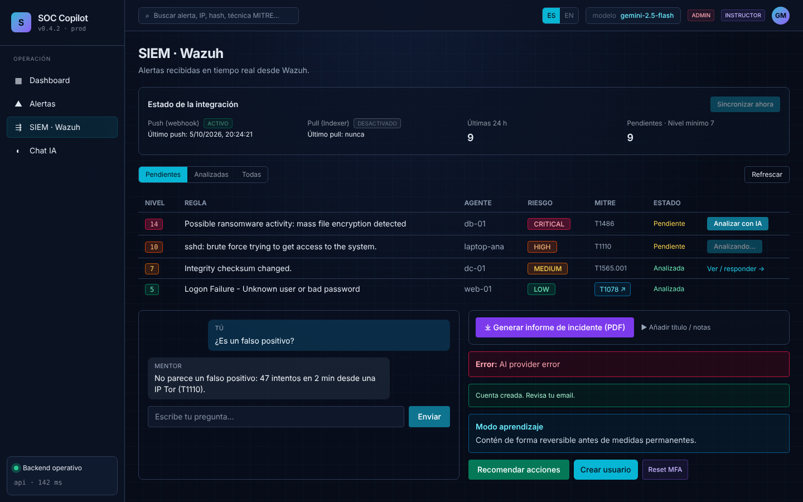
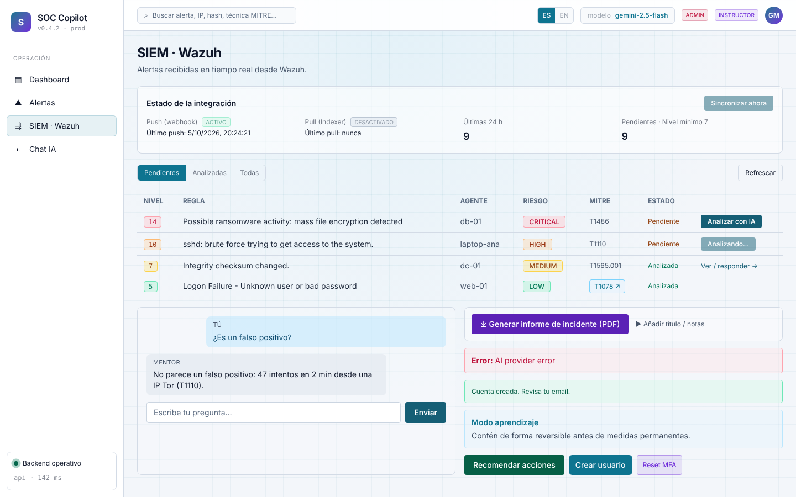
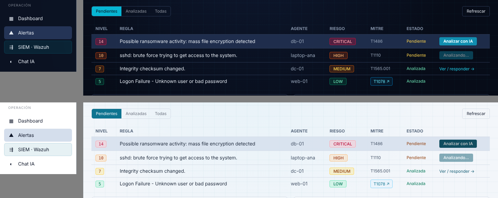

# 18 · Paleta de colores (modo oscuro y claro)

> Rediseño de color pedido tras la Práctica 2: en modo claro los textos de
> acento eran pálidos sobre blanco y en modo oscuro bordes y textos
> atenuados apenas se distinguían.

| Modo oscuro | Modo claro |
|---|---|
|  |  |

## 1. Cómo funciona

- Los colores de Tailwind usados en la app (`slate`, `cyan`, `sky`,
  `emerald`, `amber`, `orange`, `rose`, `violet`, `ink`, `risk`) están
  redefinidos en `tailwind.config.ts` como **variables CSS**
  (`rgb(var(--c-rose-300) / <alpha-value>)`).
- `src/app/globals.css` da a cada variable un valor distinto según
  `data-theme` (oscuro por defecto, `[data-theme="light"]` para claro).
- Los componentes **no cambian de clases**: siguen escritos con la
  semántica de modo oscuro y el tema claro devuelve el tono que cumple el
  mismo papel sobre blanco:

| Rol | Clases típicas | Oscuro | Claro |
|---|---|---|---|
| Texto de acento | `text-rose-300`, `text-cyan-400` | tono 300/400 | tono 700 (800 en ámbar/naranja) |
| Tinte de fondo | `bg-rose-900/40`, `bg-sky-950/30` | 900/950 | 100 |
| Borde suave | `border-emerald-700` | 700 | 300 |
| Botón sólido | `bg-cyan-600 … text-white` | 700 de Tailwind | 800 de Tailwind |
| Texto neutro | `text-slate-200 / 400 / 500` | claros | oscuros |
| Superficies | `bg-ink-950/900/800`, `border-ink-700` | azul marino | blanco / gris azulado |

- Se eliminaron todos los parches `[data-theme="light"] … !important`.

## 2. Contraste (WCAG 2.1 AA)

Comprobado por script para todas las combinaciones de texto usadas
(acento sobre panel, acento sobre su tinte, blanco sobre botón sólido,
texto neutro sobre panel y fondo): **todas ≥ 4,5:1 en los dos temas**.
Ejemplos: `text-slate-500` 5,8 (oscuro) / 5,4 (claro); «Pendiente»
(`text-amber-300`) en claro 6,8; botón «Analizar con IA» 5,4 / 7,9.

## 3. Otros cambios

- Botones sólidos: `text-white` explícito, `hover:brightness-110` (funciona
  igual en ambos temas) y estado deshabilitado legible.
- Campos de formulario con `text-white` fijo → `text-slate-100` (en claro
  eran blanco sobre blanco).
- Logo con el mismo degradado cian→violeta que el avatar.
- Dashboard: colores de las gráficas (Recharts) según el tema (`CHART` en
  `app/dashboard/page.tsx`).
- Bordes por defecto del tema (`--border-color`) en `@layer base`.

## 4. Hover y estados deshabilitados (revisión 2)



- Botones sólidos: al pasar el ratón **aclaran en oscuro y oscurecen en
  claro** (`filter: brightness`), así el cambio se nota en los dos temas.
- Filas de tabla: se resaltan al pasar el ratón.
- Menú lateral: fondo más marcado y texto en color principal al hover.
- Botones de acento claro (`bg-cyan-500 … hover:bg-cyan-400`): en claro el
  hover usa un tono más oscuro (antes era idéntico y no cambiaba nada).
- **Deshabilitado = mismo color atenuado** (`disabled:opacity-50`), ya no
  gris. En SIEM solo se deshabilita la fila que se está analizando.
- «Sincronizar ahora» explica con un tooltip por qué está desactivado.
- Foco de teclado visible (`:focus-visible`).

## 5. Aplicar los cambios en Docker (desarrollo)

`infra/docker-compose.yml` monta ahora también `apps/web/tailwind.config.ts`
en el contenedor `web`. Antes solo se montaba `src/`, así que un cambio en la
configuración de colores no se aplicaba sin reconstruir la imagen (y el
resultado era una mezcla del CSS nuevo con la configuración vieja).

```powershell
cd infra
docker compose --env-file ../.env up -d --force-recreate web
```

Después, en el navegador, recarga forzada (`Ctrl + F5`).

## 6. Cómo cambiar un color en el futuro

Edita el valor de la variable en `globals.css` (bloque oscuro y/o claro)
y vuelve a comprobar el contraste. No hace falta tocar componentes.
