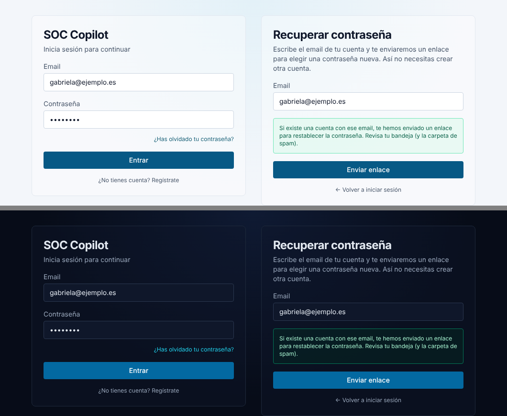

# 19 · «¿Has olvidado tu contraseña?»

> Petición del equipo: en el login no había forma de recuperar la
> contraseña y la gente acababa creando otra cuenta.

## 1. Flujo

1. En `/login` → enlace **«¿Has olvidado tu contraseña?»** (rellena el
   email si ya estaba escrito) → `/forgot-password`.
2. El usuario escribe su email → `POST /api/auth/forgot-password`.
   - Respuesta **siempre igual** (202, mismo mensaje y ~0,4 s) exista o no
     la cuenta → no permite averiguar qué emails están registrados.
   - Si existe: se genera un token aleatorio (32 bytes), se guarda **solo su
     SHA-256** y se envía por email el enlace `/reset-password?token=…`.
3. En `/reset-password` elige la contraseña nueva (mismas reglas y medidor
   de fortaleza que el registro) → `POST /api/auth/reset-password`.
4. Al cambiarla: `password_version` + 1 (**se cierran todas sus sesiones**),
   token borrado (un solo uso), se desbloquea la cuenta y el email queda
   verificado (abrir el enlace demuestra que el correo es suyo).
5. **El MFA no se toca**: en el siguiente login seguirá pidiendo el código.
   Si también ha perdido el móvil → códigos de recuperación o «Reset MFA»
   por un admin ([17-mfa-totp.md](17-mfa-totp.md)).

## 2. Seguridad

| Control | Valor |
|---|---|
| Caducidad del enlace | `PASSWORD_RESET_TTL_MINUTES` (30 min por defecto) |
| Un solo uso | el hash se borra al usarlo o al detectar que caducó |
| Token en BD | solo SHA-256 (un volcado de la BD no sirve para resetear) |
| Enumeración de cuentas | respuesta y tiempo idénticos exista o no el email |
| Abuso / spam de correos | 5/min por IP + **3/hora por email** |
| CSRF | `enforce_same_origin` como el resto de endpoints de auth |
| Auditoría | `auth.password_reset_requested`, `auth.password_reset` |

## 3. Email (SMTP)

Usa la misma configuración SMTP que la verificación de email (`SMTP_*` en
`.env`, ver [operations.md](operations.md)). **Sin SMTP y fuera de
producción** la página muestra el enlace directamente («Modo desarrollo»),
igual que hace el registro; en producción nunca se muestra.

## 4. Archivos

- Backend: `app/routers/auth.py` (`/forgot-password`, `/reset-password`),
  `app/schemas/auth.py`, `app/services/email.py` (plantilla del correo),
  `app/middleware/ratelimit.py`, `app/models.py`, `app/config.py`,
  migración `0007_password_reset`.
- Frontend: enlace en `app/login/page.tsx`, páginas nuevas
  `app/forgot-password/page.tsx` y `app/reset-password/page.tsx`,
  `lib/api.ts`, textos ES/EN/FR en `lib/i18n.tsx`.
- Tests: `tests/test_password_reset.py` (offline) y
  `tests/test_e2e_password_reset.py` (Postgres, en CI).
